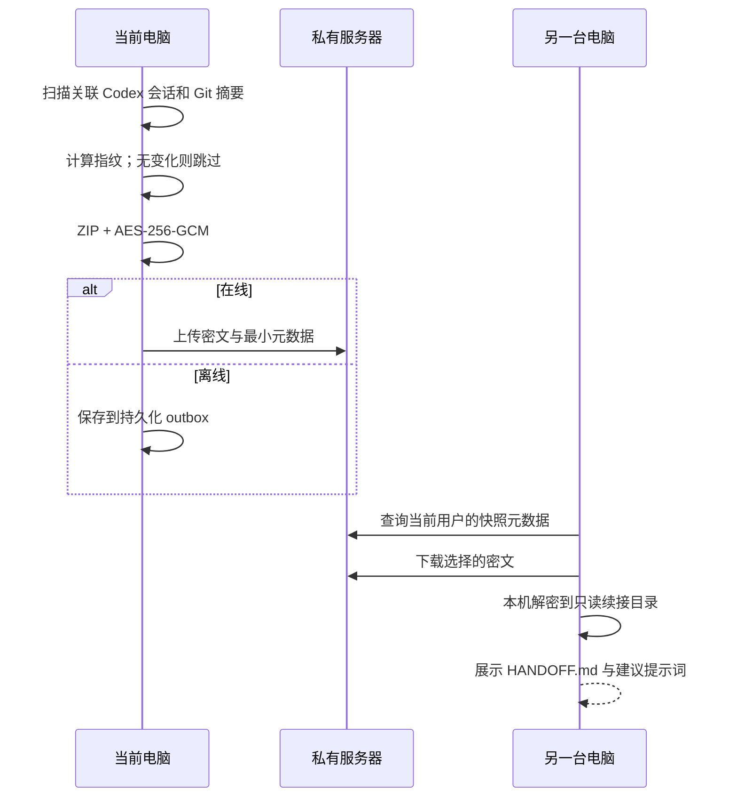

# 架构与技术选型

## 总体架构

一个仓库，两个部署单元：

```text
Windows 电脑 A / B
  Codex Continuity（Tauri 2）
    ├─ React：会话、同步、设置和托盘界面
    ├─ Rust：Windows 集成、凭据、调度、状态合并
    └─ continuity-core（Go sidecar）
       ├─ 扫描 Git 项目与关联 Codex 会话
       ├─ 构建只读快照
       ├─ AES-256-GCM 加密
       ├─ 上传、下载、离线队列重试
       └─ 导入、导出和 HANDOFF.md

个人或公司私有服务器
  continuity-server（Go）
    ├─ REST API
    ├─ 用户、设备和 API 令牌
    ├─ SQLite 元数据
    ├─ 密文文件存储
    └─ React 管理页面
```

服务端不调用 OpenAI。唯一网络要求是客户端能访问私有服务器。

## 为什么是外部客户端，而不是 Skill / MCP / Plugin

- 后台常驻、开机启动、托盘、离线队列和自动重试需要操作系统进程；
- Skill 适合说明工作流，不适合承载持续同步；
- MCP 只在 Codex 主动调用工具时运行，不适合后台监听；
- Plugin 可以作为未来的体验增强层，但不应成为安全存储和同步主体；
- 外部客户端即使 Codex 插件被禁用也能独立工作。

## 技术栈

### Tauri 2 + React + Rust

- Tauri 负责轻量 Windows 主窗口、托盘、多窗口、单实例和安装包；
- React 复用桌面端与管理端的交互模式；
- Rust 负责系统集成、凭据、后台调度和前后端命令边界。

### Go 1.26

- 客户端 sidecar 与服务器共享协议和数据结构；
- Linux 服务端可以交付为单进程；
- 适合流式文件、跨平台构建和 Docker 部署；
- 目标 Windows 电脑不需要预装 Go。

### SQLite + 文件系统

- SQLite 保存用户、令牌摘要、设备和快照元数据；
- 文件系统保存端到端加密的 `.ccx`；
- 小团队无需额外维护 PostgreSQL、Redis 或 S3；
- 后续可增加 S3 兼容对象存储。

## 同步数据流



## Codex 边界

Continuity 只读扫描 Codex 会话文件，不写入 Codex 内部数据库。

本机已有任务可以原生继续；跨机器任务使用“上下文续接”。除非 Codex 将来提供稳定的官方跨主机导入接口，否则不声称原生任务 ID 能完整迁移。
