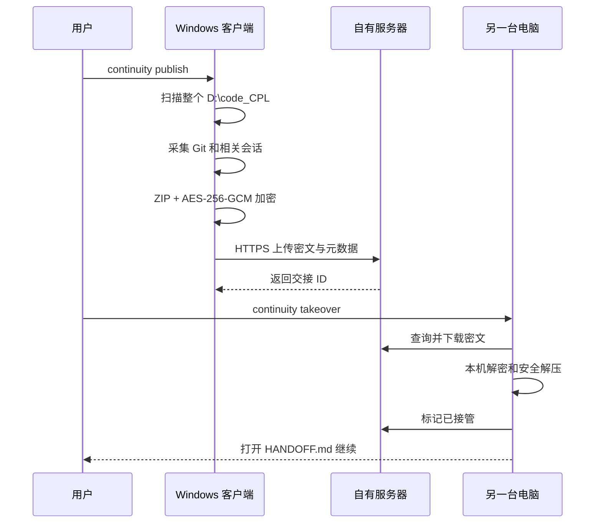

# 架构与技术选型

## 1. 推荐架构

一个仓库，两个部署单元：

```text
电脑 A / 电脑 B
  continuity.exe
    ├─ 扫描固定工作根目录
    ├─ 采集 Git 与相关 Codex 会话快照
    ├─ 本机打包和 AES-256-GCM 加密
    ├─ HTTPS 上传/下载
    └─ 解密并生成 HANDOFF.md

个人云服务器
  continuity-server
    ├─ REST API
    ├─ 登录、用户和设备令牌
    ├─ SQLite 元数据
    ├─ 密文文件存储
    └─ React 管理网页
```

服务端不调用 OpenAI，也不需要能访问 Codex。唯一网络关系是两台客户端能访问个人服务器。

## 2. 技术栈结论

### 核心：Go 1.26

客户端和服务端共用 Go 数据结构与协议。

选择原因：

- Windows 客户端可交付为约 7 MB 的单文件 EXE；
- 目标电脑无需安装 Node、Python、.NET 或 Go；
- Linux 服务端单进程、低内存、适合个人云服务器；
- 原生支持交叉编译；
- 并发上传、流式文件处理和后台驻留程序实现简单；
- 纯 Go SQLite 驱动不依赖 CGO，Docker 和跨平台构建稳定。

### 管理端：React + TypeScript + Vite

- 管理页面较多，包含登录、主题、用户、令牌、设备与交接状态；
- 组件状态与交互复杂度已超过原生 HTML/JS 的舒适范围；
- 构建后是纯静态文件，运行时不依赖 Node；
- 所有资源随容器发布，不使用 CDN。

### 数据：SQLite + 文件系统

- SQLite 保存用户、会话、令牌摘要、设备和交接元数据；
- 加密交接包保存在文件系统；
- 个人或小团队场景无需单独维护 PostgreSQL、Redis、S3；
- 未来可以增加 S3 兼容对象存储，但不是当前依赖。

## 3. 对比过的其他方案

| 方案 | 优点 | 不作为当前主方案的原因 |
|---|---|---|
| Python/FastAPI | 开发快，和 `bi_center` 技术接近 | Windows 客户端打包较大，容易遇到杀毒误报，运行时与依赖管理更重 |
| Node.js | 前后端统一 TypeScript | 服务端可用，但 Windows 单文件后台客户端和系统托盘交付不如 Go 稳定简洁 |
| .NET | Windows 托盘、DPAPI、企业登录能力强 | Linux 容器和发布物更大；当前功能不需要完整企业框架 |
| Rust | 性能、内存和单文件交付优秀 | 开发与维护成本更高，当前没有必须使用 Rust 的性能瓶颈 |
| Electron/Tauri 客户端 | 易做完整桌面 GUI | 第一版只需 CLI/后台能力；增加安装包、升级和签名复杂度 |

技术选择依据是目标环境、运维成本、交付体积和长期维护，不是开发电脑当前安装了什么。

## 4. 为什么第一阶段不做 Skill、Plugin 或 MCP

用户已选择“外部服务 + 小工具”。

- Skill 只能告诉 Codex 如何调用现有能力，不负责后台上传和跨电脑存储；
- MCP 只在 Codex 调用工具时工作，不适合系统托盘、断网队列、开机启动和自动重试；
- Plugin 可以作为未来体验增强层，但不是安全存储和同步的主体；
- 外部客户端即使 Codex Plugin 被禁用也能独立工作。

后续如果需要“在 Codex 内发送一句话即可发布”，可以在不改变服务端协议的前提下增加薄 Plugin/MCP 适配层。

## 5. 当前数据流



## 6. 仓库结构

```text
cmd/
  continuity-client/     Windows 客户端入口
  continuity-server/     Linux/Windows 服务端入口
internal/
  client/                扫描、打包、加密、HTTP 客户端
  model/                 共享数据模型
  server/                API、认证、SQLite、密文存储
web/                     React 管理端
scripts/                 Windows 构建和本地运行脚本
release/                 构建产物（不提交）
docs/                    规划、架构、部署和设计资料
```
