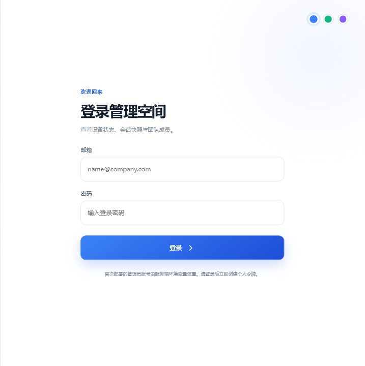
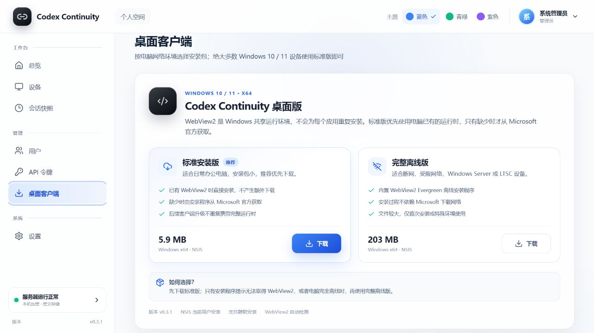
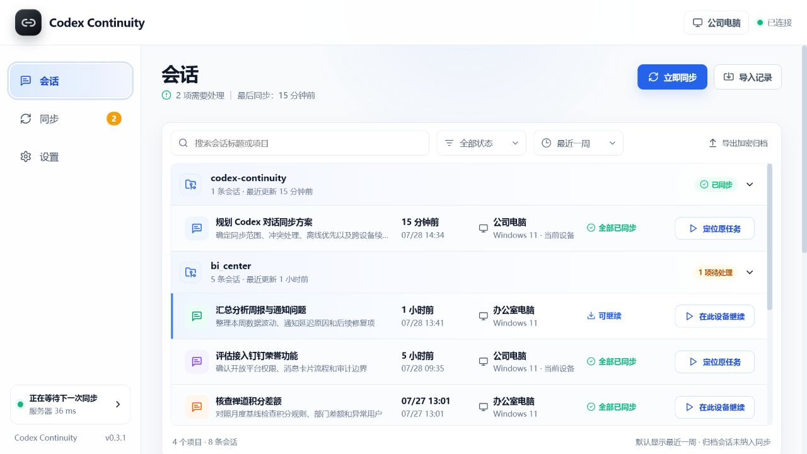
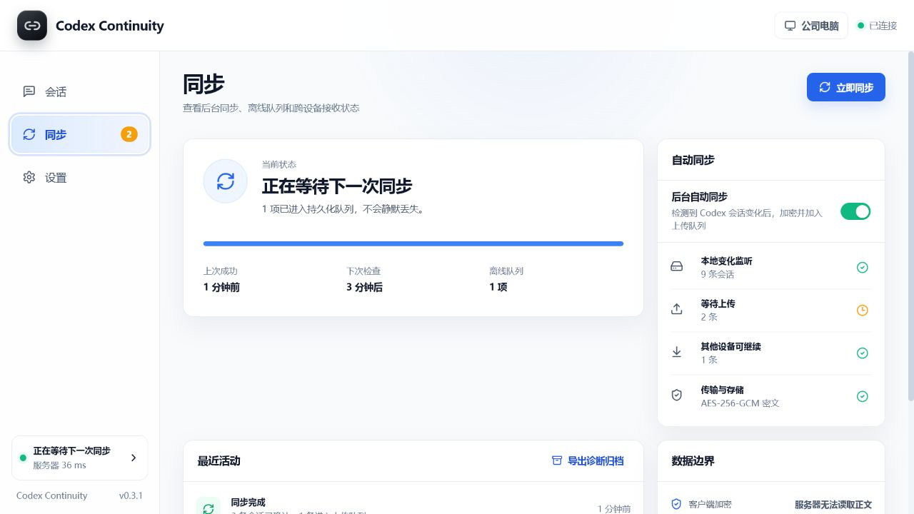
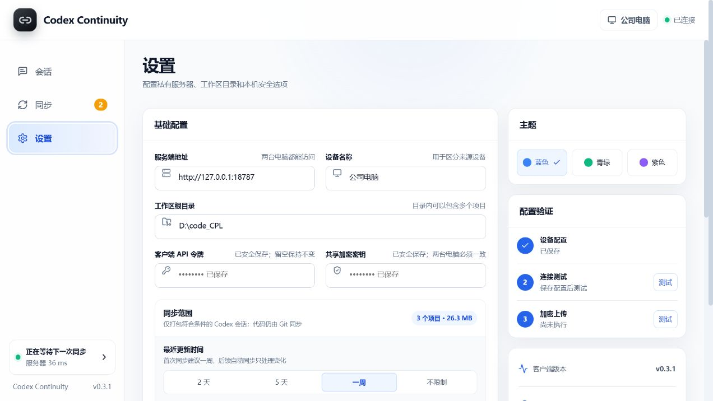

# 客户端与服务端交互设计审计

日期：2026-07-28
范围：服务端登录与客户端下载、桌面端会话、同步、设置
视口：1280 × 720
结论：核心路径已经清晰可用，视觉语言基本统一；本轮已修正安装版本说明、工作区术语和本机会话按钮语义。同步进度表达和首次配置引导仍是下一轮最值得优化的两项。

## 1. 服务端登录

健康度：良好

- 优点：品牌、产品价值和登录操作分区明确；表单顺序自然；主操作只有一个。
- 风险：主题色切换只有色点，虽有可访问名称，但仅靠颜色表达选中状态对部分用户不够明显。建议增加选中描边或勾选。
- 限制：截图只能检查可见层级，无法证明密码管理器、错误焦点转移和屏幕阅读器播报是否正确。

## 2. 服务端客户端下载

健康度：良好

- 优点：标准版与完整离线版并列比较，推荐项、真实体积、网络要求和 WebView2 处理方式都在下载前说明。
- 本轮修正：下载信息改由 `desktop-release.json` 驱动；旧的 “NSIS / MSI” 文案已移除；图标统一为石墨黑与银灰色。
- 建议：后续增加代码签名发布者、SHA-256 复制按钮和最近发布时间，进一步增强下载信任感。

## 3. 桌面端会话

健康度：良好，有一处关键语义已修正

- 优点：以项目分组、默认最近一周、同步状态和来源设备共同构成清晰的信息层级。
- 本轮修正：本机已有会话的操作改为“定位原任务”，跨设备会话仍显示“在此设备继续”，避免让用户误以为应用能直接深链打开 Codex 原任务。
- 建议：当前每一行和右侧详情都有操作按钮，信息密集时略显重复。后续可让行内按钮只在悬停、键盘聚焦或选中时出现。

## 4. 桌面端同步

健康度：可用，但状态表达需要加强

- 优点：连接、监听、待上传、可接续和加密边界集中在一页，首次同步出错时容易判断大致阶段。
- 问题：单条百分比可能已经显示 100%，但离线队列仍未清空；“待上传会话数”和“队列批次数”也可能不同，容易被理解为数据矛盾。
- 建议：把单一进度条改为“扫描 → 加密 → 上传 → 服务端确认”四段状态，并明确写出“2 条会话 / 1 个上传批次”。

## 5. 桌面端设置

健康度：可用，首次配置仍偏密集

- 优点：服务、凭据、同步范围、项目勾选、归档和上限配置集中，适合熟悉系统的管理员。
- 本轮修正：“工作根目录”统一为“工作区根目录”；“保存并验证”改为“保存配置”，与右侧独立的连接测试、加密上传测试职责一致。
- 建议：首次使用改为三步引导——连接服务器、选择同步范围、执行首次同步；高级选项仍保留在完整设置页。

## 可访问性证据边界

本轮已从可见界面确认焦点样式、按钮标签和主要文字对比度方向，没有发现明显的低对比主文本。以下项目必须通过键盘、屏幕阅读器和真实 Windows 缩放继续验证，不能仅凭截图宣称符合 WCAG：

- 全键盘操作顺序、焦点是否被弹窗正确约束；
- Toast、上传进度和错误状态是否通过 live region 播报；
- 125%、150%、200% Windows 缩放及 1366 × 768 小屏下是否发生遮挡；
- 高对比模式、减少动画设置和触控目标尺寸。
