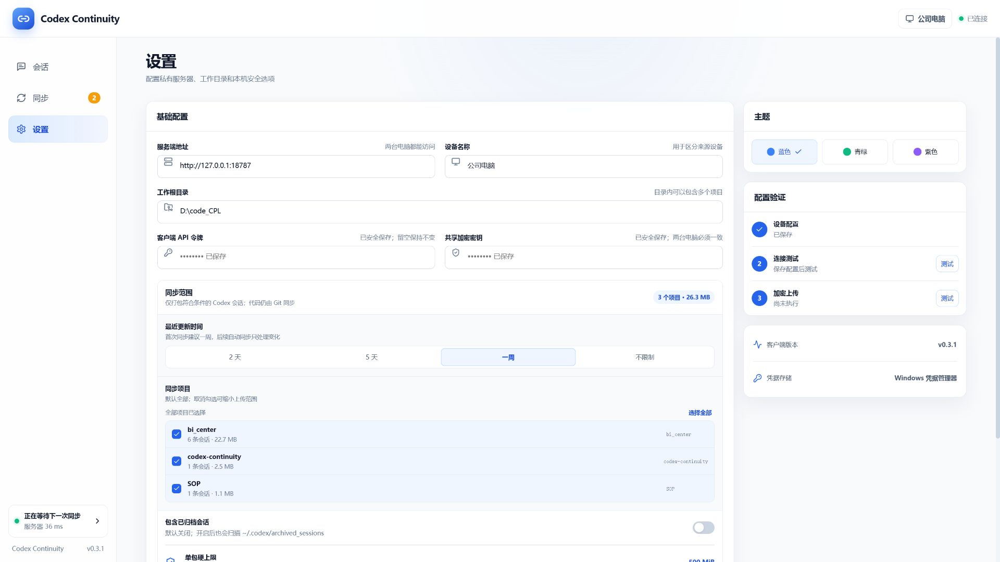
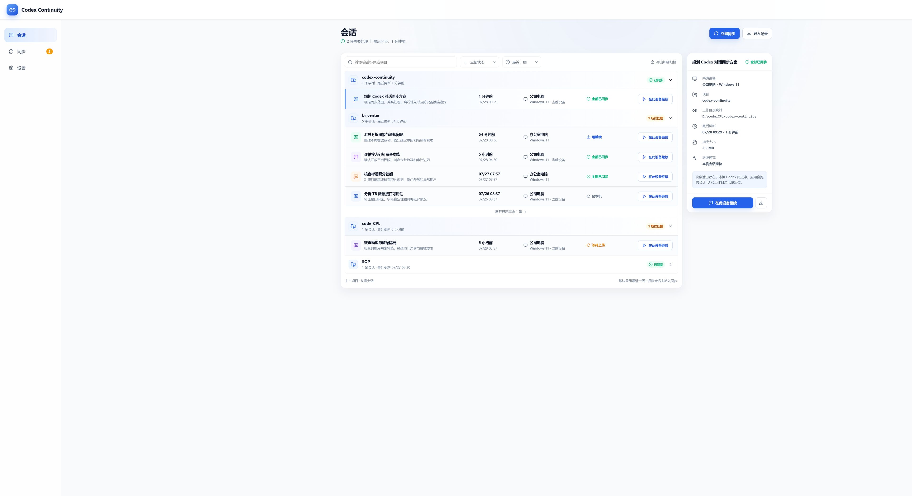

# Codex Continuity 安装包、图标与分辨率审计

审计日期：2026-07-28

## 结论

- 完整离线安装包约 202.76 MiB，主要不是业务代码，而是内置的 194.37 MiB WebView2 离线安装程序。
- 已同时提供 5.91 MiB 标准安装版和 202.76 MiB 完整离线版。标准版作为默认下载，离线版用于无法访问微软下载服务的设备。
- 应用页面已有 4 级响应式断点和 1640 px 内容宽度上限；1080p 与常见笔记本等效视口未出现横向溢出。
- 当前原生窗口最小高度为 700 个逻辑像素，对 1366×768、Windows 125% 缩放的笔记本偏高，应降低到约 600。
- 4K 在 Windows 150%–200% 系统缩放下等效于常规桌面视口，结构正常；4K 100% 缩放时界面会显得过小、留白过多。

## 安装包体积实测

| 组成 | 大小 |
| --- | ---: |
| NSIS 标准安装版 | 5.91 MiB |
| NSIS 完整离线版 | 202.76 MiB |
| WebView2 离线安装程序 | 194.37 MiB |
| 桌面应用 EXE | 15.19 MiB |
| 同步核心 sidecar | 6.55 MiB |
| 当前便携 ZIP | 7.79 MiB |
| 全套图标资源 | 3.33 MiB |

当前使用基础配置与离线覆盖配置分别构建：

```json
{
  "webviewInstallMode": {
    "type": "downloadBootstrapper",
    "silent": true
  }
}
```

完整离线版覆盖为 `offlineInstaller`。

### 已实施发布矩阵

1. `windows-x64-setup.exe`
   - 使用 `downloadBootstrapper`。
   - 实测约 5.91 MiB。
   - Windows 10/11 通常已有 WebView2，此时安装速度最快。

2. `windows-x64-offline-setup.exe`
   - 保留 `offlineInstaller`。
   - 约 203 MiB。
   - 用于内网、离线或无法访问微软下载服务的设备。

3. MSI 暂缓
   - 仅在明确需要组策略、Intune、SCCM 或其他企业软件分发平台时恢复。

离线 NSIS 当前使用默认 LZMA 压缩。可以另做一次 `zlib` 构建基准，换取更快解压，但可能增加文件体积；真正的大幅改善仍来自不再内置 194.37 MiB WebView2。

## 图标

当前安装器已通过 `installerIcon: "icons/icon.ico"` 使用应用图标，因此可以统一替换：

- 安装程序和卸载程序图标；
- Windows 任务栏、开始菜单和窗口图标；
- 托盘与应用内品牌图标。

本次生产图标：

- [石墨黑连续链路图标](../../design/app-icon-graphite-preview.png)

保留现有连续链路纹样，改为石墨黑渐变底和银灰线条，并已同步覆盖安装程序、任务栏、开始菜单、托盘和应用内品牌标记。

## 分辨率审计步骤

### 1. 1366×768 笔记本在 125% 缩放下的等效视口（1093×614）

状态：基本健康，有原生窗口尺寸风险。


- 页面无横向或文档级纵向溢出。
- 会话主路径、筛选、同步按钮和项目分组仍可见。
- 当前 `minHeight: 700` 高于该等效视口的 614，真实桌面窗口可能无法完整落入可用工作区。
- 多列会话信息开始紧凑，但没有结构性错位。

### 2. 1080p 桌面（1920×1080）

状态：健康。



- 两栏设置布局完整，字段宽度和层级稳定。
- 页面本身无横向溢出；较长设置内容在主内容区内垂直滚动。
- 1640 px 内容宽度上限避免了表单无限拉宽。

### 3. 4K 桌面 100% 缩放（3840×2160）

状态：结构健康，视觉密度偏低。



- 页面无横向溢出，内容宽度固定为 1640 px 并居中。
- 超宽屏不会拉坏表格，但 100% 缩放下文字和控件物理尺寸偏小，左右留白很大。
- Windows 推荐的 150%–200% 缩放会把 CSS 逻辑视口降到常规桌面范围，体验更自然。

## 建议优先级

### P0

- 将原生窗口最小尺寸从 `1040×700` 调整为约 `960×600`，保留现有 1040 px 移动侧栏断点。
- 发布在线和离线两种安装包，并在下载页明确标注使用场景。

### P1

- 将 10–11 px 的辅助信息逐步提升到至少 12 px，主要正文尽量保持 13–14 px。
- 在应用设置中增加 90% / 100% / 110% / 125% 的界面缩放选项，覆盖 4K 100% 和远距离显示器场景。
- 为离线安装包比较 LZMA 与 zlib 的安装耗时、体积和 CPU 占用。

### P2

- 增加自动化截图矩阵：960×600、1093×614、1366×768、1536×864、1920×1080、3840×2160。
- 在 Windows 真机上补测 100%、125%、150%、200% DPI，以及外接显示器之间拖动窗口时的 Per-Monitor V2 行为。

## 可访问性边界

- 样式中已有 `:focus-visible` 和 `prefers-reduced-motion` 支持。
- 截图无法证明键盘顺序、屏幕阅读器语义、实际 DPI 切换和全部颜色对比度合规。
- NSIS 安装器清单已声明 `PerMonitorV2` DPI 感知，但仍需在不同 DPI 的 Windows 真机上验证字体、按钮和进度条。
